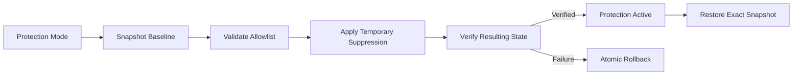
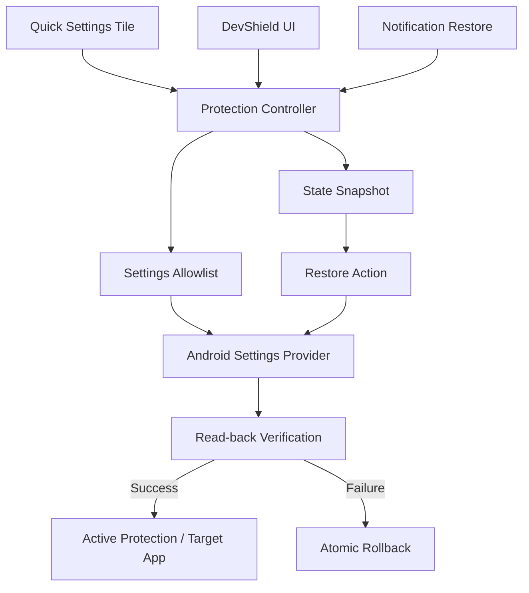

# DevShield 🛡️

Temporarily suppress Android developer and debugging settings so apps that reject them can run — then restore everything exactly as it was.

[](https://github.com/nihal-here/DevShield/releases)
[-3DDC84.svg?logo=android)](https://developer.android.com)
[-blue.svg)](https://developer.android.com)
[]()
[]()
[](https://github.com/nihal-here/DevShield/actions/workflows/build.yml)

> DevShield temporarily suppresses Android developer and debugging settings so applications that reject debugging-enabled devices can run without permanently changing the user's development environment.

---

## 💡 Why DevShield?

Android engineers, power users, and developers regularly keep Developer Options, USB Debugging, or Wireless Debugging enabled on their daily-use devices. However, certain consumer applications—including corporate enterprise suites, streaming services, and financial applications—inspect system debugging flags and refuse to launch on debugging-enabled devices.

Manually navigating system settings menus to toggle options off before opening an app and then navigating back to re-enable them afterward is tedious, error-prone, and disrupts your setup.

**DevShield** automates this workflow safely:
1. **Snapshots** your active settings before making changes.
2. **Suppresses** developer flags with verified read-backs.
3. **Optionally launches** your target application.
4. **Restores** your original configuration with a single tap from the Quick Settings panel, notification shade, or in-app interface.

---

## ✨ Features

* **🛡️ One-Tap Protection Mode**: Snapshots active developer settings, temporarily disables them, and verifies suppression.
* **⚡ Quick Settings Tile**: Activate and restore Protection Mode directly from Android's Quick Settings shade without opening the application.
* **📶 Configurable Wireless Debugging**: Choose whether Wireless Debugging is suppressed alongside USB debugging or preserved for wireless workflows.
* **📱 Target App Launcher**: Optional quick selector to launch your target application automatically upon entering Protection Mode.
* **🔒 Exact State Restoration**: Restores your exact pre-launch baseline rather than blindly turning settings on.
* **⚡ Atomic Rollback**: If a write fails or verification does not match, all settings revert immediately to prevent inconsistent states.
* **💾 Durability & Crash Recovery**: State snapshots are committed to private storage before system modifications occur. If the app is killed or the phone reboots, DevShield detects the un-restored state on next launch.
* **🔔 Notification Shade Action**: Ongoing status notification provides immediate one-tap restoration from anywhere in the OS.
* **📊 Live System Diagnostics**: Real-time monitor of Developer Options, USB Debugging, and Wireless Debugging status.
* **🌓 System Adaptive Theme**: Thoughtfully styled light and dark themes following Android system settings.
* **🔒 Strict Privacy & Security**: Zero network permissions, zero accessibility services, and an explicit compile-time settings allowlist.

---

## ⚖️ What DevShield Is and Is Not

| DevShield IS | DevShield IS NOT |
|---|---|
| A focused debugging-suppression utility | **Not a root tool** (requires no root and modifies no system partitions) |
| Offline and private (zero network permissions) | **Not a VPN** (does not route, proxy, or inspect network traffic) |
| Powered by native `WRITE_SECURE_SETTINGS` | **Not an accessibility hack** (no accessibility service or UI overlays) |
| Constrained to an explicit compile-time allowlist | **Not an arbitrary settings editor** (cannot touch other settings) |
| State-preserving with atomic rollback | **Not a permanent disabler** (restores your exact baseline) |

> [!NOTE]
> **Scope & Environmental Checks**:
> DevShield addresses a specific, well-defined category of integrity checks: applications that inspect Android developer and ADB debugging flags (`development_settings_enabled`, `adb_enabled`, `adb_wifi_enabled`).
> 
> DevShield does **not** bypass bootloader unlock detection, Play Integrity / SafetyNet verdicts, root detection, or emulator checks. Applications enforcing requirements beyond developer settings are outside DevShield's operational scope.

---

## 🚀 How It Works



### System Architecture



---

## ⚙️ Settings Logic

DevShield operates strictly against an explicit allowlist of supported settings. No other system setting can be queried or modified.

### Supported Settings Surface

| Setting Key | System Scope | Default Action | Description |
|---|---|---|---|
| `development_settings_enabled` | `Settings.Global` | Suppressed (`0`) | Master switch for Android Developer Options |
| `adb_enabled` | `Settings.Global` | Suppressed (`0`) | Android Debug Bridge over USB |
| `adb_wifi_enabled` | `Settings.Global` | Suppressed (`0`) [Configurable] | Android Debug Bridge over Wi-Fi |

### Execution Lifecycle

#### Entering Protection Mode
1. **Query Current State**: Reads the active integer value for each supported setting.
2. **Atomic Snapshot**: Commits a timestamped `SettingSnapshot` containing pre-launch values to private application storage *before* any modification begins.
3. **Allowlist Validation**: Confirms candidate settings against `SettingsWhitelist` at the code boundary.
4. **Conditional Suppression**: If a setting is already `0`, no redundant write occurs. If `1`, it is written to `0`. If "Suppress Wireless Debugging" is toggled OFF, `adb_wifi_enabled` is bypassed entirely.
5. **Read-back Verification**: Queries `Settings.Global.getInt()` immediately after each write to verify the new state.
6. **Atomic Rollback**: If any write or verification check fails, DevShield immediately restores all modified settings to their captured snapshot values and clears the pending state.
7. **Target App Launch**: Upon successful verification, launches the configured target application (if selected).

#### Restoration
1. **Retrieve Snapshot**: Loads the active baseline from private storage.
2. **Exact Baseline Restoration**: Restores each setting to the exact value captured prior to entering protection (`1` or `0`). It does not assume settings should be re-enabled.
3. **Verification & Cleanup**: Verifies restored values, dismisses the ongoing notification, updates the Quick Settings tile, and clears the active snapshot.

---

## ⚡ Quick Settings Tile

DevShield includes an Android Quick Settings tile (`TileService`) enabling 1-tap toggling directly from your notification panel:

* **When Inactive**: Tapping the tile runs the verified Protection Mode flow, snapshots settings, suppresses developer flags, launches your target app (if configured), and updates the tile to **Active**.
* **When Active**: Tapping the tile restores all settings to their exact pre-launch baseline, clears the ongoing notification, and returns the tile to **Inactive**.
* **Setup Required**: If `WRITE_SECURE_SETTINGS` has not yet been granted, the tile indicates setup is required and opens the app with setup instructions upon tapping.
* **Full Synchronization**: The tile stays synchronized with in-app toggles and notification restore actions without maintaining an active background daemon.

---

## 📡 Wireless Debugging & Shizuku Compatibility

DevShield provides user-configurable **Wireless Debugging** (`adb_wifi_enabled`) protection:

### User Preference Toggle
Inside the Protection Mode card, users can toggle **Suppress Wireless Debugging** (default: **ON**):
* **When ON**: Developer Options, USB Debugging, and Wireless Debugging are all suppressed.
* **When OFF**: Developer Options and USB Debugging are suppressed, while Wireless Debugging remains active.

### Impact on Shizuku and Wireless ADB Services
Wireless Debugging operates via dynamic TLS-authenticated ADB sessions over Wi-Fi:
* In AOSP (`AdbDebuggingManager`), disabling Wireless Debugging (`adb_wifi_enabled = 0`) closes the ADB listener.
* If you run **Shizuku** via Wireless Debugging, disabling Wireless Debugging terminates the active connection, causing Shizuku to stop.
* **Pairing vs. Active Connection**: Android stores Wi-Fi pairing credentials persistently. When Wireless Debugging is restored, pairing information typically remains intact; you generally only need to tap "Start" in Shizuku rather than pairing from scratch.

> [!TIP]
> **Recommended Preference**:
> * **If you depend on Shizuku** or active wireless ADB connections while running your protected application, turn **Suppress Wireless Debugging OFF**.
> * **If you do not need wireless ADB** during app execution, leave it **ON** for complete debugging suppression.

---

## 🔒 Security & Privacy Design

DevShield is designed to minimize trust requirements and strictly limit its operational scope:

* **Zero Network Access**: The manifest excludes `INTERNET` and `ACCESS_NETWORK_STATE`. Network transmission and telemetry exfiltration are impossible.
* **Constrained Settings Surface**: Only three explicit keys (`DEVELOPMENT_OPTIONS`, `USB_DEBUGGING`, `WIRELESS_DEBUGGING`) are mutable. Any call targeting an unapproved key throws a fatal `SecurityException`.
* **Synchronous Verified Writes**: Settings writes are never assumed to succeed; DevShield synchronously queries `Settings.Global` to verify the state.
* **Atomic Rollback**: If a write fails or verification returns an unexpected value, all previously altered settings are immediately reverted.
* **Durability Across Process Restarts**: Snapshots are committed to disk before modifications begin. If the process is terminated or the device reboots, DevShield detects the un-restored state on next launch and displays an emergency restore banner.
* **No Accessibility Services / No Root**: Operates strictly through `WRITE_SECURE_SETTINGS` granted via ADB. DevShield requires no root binaries, no Xposed/LSPosed modules, and no accessibility permissions.

---

## 🔍 Open Source & Trust Model

Utilities that require privileged permissions such as `WRITE_SECURE_SETTINGS` must be fully transparent. 

DevShield is open source so users, system administrators, and security researchers can independently inspect:
* The permissions requested in `AndroidManifest.xml` (confirming zero network access).
* The compile-time `SettingsWhitelist` boundary.
* The state snapshot and rollback mechanisms.
* The build configuration and dependencies.

Published release artifacts correspond directly to tagged versions in this repository.

---

## 🤖 Development Transparency

DevShield was developed with assistance from AI coding tools. AI assistance was used for implementation, refactoring, documentation, test development, and debugging. The resulting code, behavior, permissions, and release artifacts are reviewed and validated as part of the project development process.

---

## 🤝 Credits & Related Projects

### Related Projects & Prior Art
DevShield addresses a problem similar to projects such as **[Geto](https://github.com/JackEblan/Geto)** by Jack Eblan: temporarily suppressing Android developer/debugging settings so applications that reject those settings can run.

DevShield is not affiliated with Geto and was implemented independently from scratch. DevShield uses a single-module View-based architecture, an explicit compile-time allowlist with synchronous verification, and zero background services.

### Comparison with Geto

| Dimension | DevShield | Geto |
|---|---|---|
| **Primary Purpose** | Developer/debugging suppression with atomic state recovery | Automated/rule-based developer & secure settings toggling |
| **Settings Surface** | Constrained allowlist (Developer Options, USB Debugging, Wireless Debugging) | Dynamic / broad settings observation across System, Secure, and Global |
| **Wireless Debugging** | Native suppression with user-configurable toggle & Shizuku warning | Requires manual configuration / rule setup |
| **Architecture** | Single-module, zero background services, broadcast receivers | Multi-module Clean Architecture, Hilt DI, persistent Foreground Service |
| **Quick Settings** | Built-in toggle tile (Active/Inactive state toggle) | Supported via tile & shortcuts |
| **State Model** | Pre-modification snapshot with verified read-backs & atomic rollback | Coroutines & Proto DataStore with continuous ContentObserver |
| **Network Access** | Offline (zero network permissions) | Offline (zero network permissions) |
| **License** | Apache License 2.0 | GNU General Public License v3.0 (GPL-3.0) |

### Shizuku
[Shizuku](https://shizuku.rikka.app/) is an independent, third-party Android tool developed by Rikka. DevShield does not bundle or fork Shizuku. Shizuku is noted here because Wireless Debugging can serve as Shizuku's ADB transport; DevShield includes explicit preference controls to prevent disrupting Shizuku workflows.

---

## 📦 Installation & Setup

### 1. Download DevShield
Download the single recommended APK (`DevShield-v1.3.0.apk`) from [GitHub Releases](https://github.com/nihal-here/DevShield/releases) or build it locally.

```bash
adb install DevShield-v1.3.0.apk
```

### 2. Grant Privileged Permission (One-Time Setup)
Because DevShield does not require root, it relies on Android's native `WRITE_SECURE_SETTINGS` permission (`signature|privileged|development`). Run the following command once from a computer via ADB:

```bash
adb shell pm grant com.devshield android.permission.WRITE_SECURE_SETTINGS
```

*(On Android 13+, DevShield will request runtime Notification permission so it can post the persistent Restore action to your notification shade).*

### 3. Add Quick Settings Tile (Optional)
Swipe down twice from the top of your screen to open the Quick Settings panel, tap the edit (pencil) icon, and drag the **DevShield** tile into your active tiles.

---

## ❓ Frequently Asked Questions (FAQ)

### Will DevShield disconnect Shizuku?
If Shizuku was started using Wireless Debugging as its ADB transport, suppressing Wireless Debugging terminates the active session and Shizuku will stop. To avoid this, toggle **Suppress Wireless Debugging OFF** in DevShield. Pairing credentials remain stored by Android, so if Shizuku stops, you can simply tap "Start" in Shizuku after restoring settings.

### What if an application still detects a connection after entering Protection Mode?
Some applications detect physical USB connectivity by querying `BatteryManager.BATTERY_PLUGGED_USB` or kernel sysfs power supply nodes. If an application still blocks execution after developer options are turned off, disconnect the physical USB cable from your phone.

### Does DevShield maintain a background service?
No. DevShield does not run background polling services, accessibility monitors, or persistent daemons. Snapshots are stored in private disk storage, and state restoration is handled directly via broadcast receivers and system tile callbacks.

---

## 💻 Building & Testing

### Prerequisites
* JDK 17 or JDK 21
* Android SDK Platform 36 (Android 16)
* Android Build-Tools 35.0.0+

### Build APK
```bash
# Build installable debug APK
./gradlew assembleDebug

# Build release APK
./gradlew assembleRelease
```

### Run Unit Tests
DevShield contains **22 comprehensive Robolectric unit tests** validating permission checks, allowlist boundaries, verified writes, rollback atomicity, crash recovery, reboot survival, Quick Settings tile toggling, Wireless Debugging toggle behavior, exact baseline restoration, and theme resolution:

```bash
./gradlew testDebugUnitTest
```

---

## 📱 Hardware & OS Compatibility

DevShield has been tested on:
* **OnePlus Devices (OnePlus 12 / 12R / Open / Nord)** running **OxygenOS 16 / Android 16 (API 36)**
* Generic Android 8.0 (API 26) through Android 16 (API 36)

---

## 📄 License
DevShield is open-source software licensed under the [Apache License 2.0](LICENSE).
