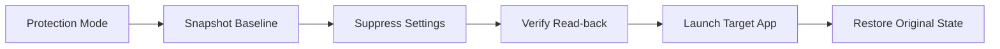
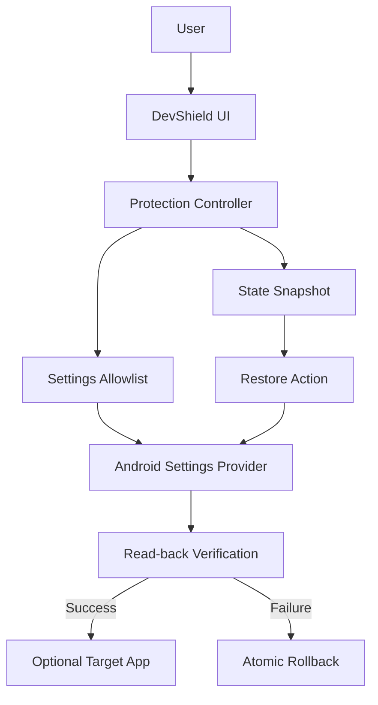

# DevShield 🛡️

Temporary Android developer and debugging suppression with atomic state recovery.

[](https://github.com/nihal-here/DevShield/releases)
[-3DDC84.svg?logo=android)](https://developer.android.com)
[-blue.svg)](https://developer.android.com)
[]()
[]()
[](https://github.com/nihal-here/DevShield/actions/workflows/build.yml)

> DevShield temporarily suppresses Android developer/debugging settings so applications that reject debugging-enabled devices can run without permanently changing the user's development environment.

---

## 📖 Overview

Android developers and engineers frequently keep Developer Options, USB Debugging, or Wireless Debugging enabled on their personal or testing devices. However, certain applications—such as enterprise portals, streaming clients, and banking apps—perform environmental integrity checks and refuse to launch when debugging flags are active.

**DevShield** solves this dilemma without requiring users to manually toggle multiple settings in Android Settings every time they want to open an app:
1. **Snapshots** your active developer and debugging settings.
2. **Temporarily suppresses** them to zero with immediate read-back verification.
3. **Launches** your chosen target app.
4. **Restores** your exact original configuration with a single tap from the notification shade or in-app interface.

### What DevShield Is and Is Not

| DevShield IS | DevShield IS NOT |
|---|---|
| A focused debugging-suppression utility | **Not a root tool** (requires no root and modifies no system partitions) |
| Offline and private (zero network permissions) | **Not a VPN** (does not route, proxy, or inspect network traffic) |
| Powered by native `WRITE_SECURE_SETTINGS` | **Not an accessibility hack** (no accessibility service or UI overlays) |
| Constrained to an explicit compile-time allowlist | **Not an arbitrary settings editor** (cannot touch other settings) |
| State-preserving with atomic rollback | **Not a permanent disabler** (restores your exact baseline) |

> [!NOTE]
> **Scope & Environment Checks**:
> DevShield addresses a specific, well-defined category of integrity checks: applications that inspect Android developer and ADB debugging flags. It does **not** bypass bootloader unlock detection, Play Integrity / SafetyNet verdicts, root detection, or emulator checks. Applications enforcing requirements beyond debugging flags are outside DevShield's operational scope.

---

## 🚀 How It Works



1. **Install DevShield**: Download the release APK and install it on your device.
2. **Grant Permission Once**: Grant `WRITE_SECURE_SETTINGS` via an ADB command from your computer.
3. **Select Target App (Optional)**: Pick your target app so DevShield can launch it automatically when protection is engaged.
4. **Configure Wireless Debugging**: Choose whether Wireless Debugging should also be suppressed (enabled by default).
5. **Enter Protection Mode**: Tap **Shield & Launch** (or **Enter Protection Mode**).
6. **Automatic Verification**: DevShield captures your current settings, applies suppression, verifies read-backs, and launches the app.
7. **One-Tap Restoration**: When you finish using the app, pull down your notification shade and tap **Restore Settings** to return to your exact developer baseline.

---

## ⚙️ Settings Logic in v1.2.0

DevShield enforces an explicit allowlist of supported settings. No other system setting can be queried or modified.

### Supported Settings Surface

| Setting Key | System Scope | Default Protection Action | Description |
|---|---|---|---|
| `development_settings_enabled` | `Settings.Global` | Suppressed (`0`) | Master toggle for Android Developer Options |
| `adb_enabled` | `Settings.Global` | Suppressed (`0`) | Android Debug Bridge over USB |
| `adb_wifi_enabled` | `Settings.Global` | Suppressed (`0`) [Configurable] | Android Debug Bridge over Wi-Fi |

### Execution Lifecycle

#### Entering Protection Mode
1. **Read Current State**: Queries the active integer value for each supported setting.
2. **Atomic Snapshot**: Commits a timestamped `SettingSnapshot` containing original values to private application storage *before* any system modification begins.
3. **Allowlist Validation**: Passes each candidate setting through `SettingsWhitelist` to ensure compile-time boundary enforcement.
4. **Conditional Suppression**: If a setting is already `0`, no redundant write is made. If `1`, it is written to `0`. If "Suppress Wireless Debugging" is toggled OFF, `adb_wifi_enabled` is bypassed entirely.
5. **Read-back Verification**: Queries `Settings.Global.getInt()` immediately after each write.
6. **Atomic Rollback**: If any write or verification fails, DevShield immediately restores all modified settings to their captured snapshot values and purges the pending state.
7. **Target App Launch**: Upon successful verification, launches the configured target application.

#### Restoration
1. **Retrieve Snapshot**: Loads the active baseline from private storage.
2. **Exact Baseline Restoration**: Restores each setting to the exact value captured prior to entering protection (`1` or `0`). It does not blindly assume settings should be re-enabled.
3. **Verification & Cleanup**: Verifies restored values, dismisses the ongoing notification, and clears the active snapshot.

---

## 📡 Wireless Debugging & Shizuku Compatibility

DevShield v1.2.0 introduces user-configurable **Wireless Debugging** (`adb_wifi_enabled`) protection.

### User Preference Toggle
Inside the Protection Mode card, users can toggle **Suppress Wireless Debugging** (default: **ON**):
* **When ON**: Developer Options, USB Debugging, and Wireless Debugging are all suppressed.
* **When OFF**: Developer Options and USB Debugging are suppressed, while Wireless Debugging remains active.

### Impact on Shizuku and Wireless ADB Services

Wireless Debugging operates via dynamic TLS-authenticated ADB sessions over Wi-Fi:
* In AOSP (`AdbDebuggingManager`), setting `adb_wifi_enabled = 0` terminates the wireless ADB daemon listener.
* If you run **Shizuku** via Wireless Debugging, disabling Wireless Debugging will disconnect the active ADB session and Shizuku will stop.
* **Pairing vs. Active Connection**: Android stores Wi-Fi pairing trust records persistently. When Wireless Debugging is restored, pairing is typically preserved; you only need to start Shizuku again rather than pairing from scratch.

> [!TIP]
> **Recommended Settings**:
> * **If you depend on Shizuku** or active wireless ADB connections while running your protected application, turn **Suppress Wireless Debugging OFF**.
> * **If you do not need wireless ADB** during app execution, leave it **ON** for complete debugging suppression.

---

## 🔒 Security & Safety Design



DevShield is engineered with defense-in-depth safety principles:

* **Constrained Settings Surface**: Only three explicit keys (`DEVELOPMENT_OPTIONS`, `USB_DEBUGGING`, `WIRELESS_DEBUGGING`) are mutable. Any call targeting an unapproved key throws a fatal `SecurityException`.
* **Verified Writes**: Settings writes are never assumed to have succeeded; DevShield synchronously queries `Settings.Global` to verify the new state.
* **Atomic Rollback**: If a write fails or verification returns an unexpected value, all previously altered settings are immediately reverted to prevent partial state corruption.
* **Durability & State Recovery**: Snapshots are written to persistent storage before modification. If DevShield's process is terminated or the device reboots during an active session, DevShield detects the unrestored snapshot on next launch and displays an emergency restore banner.
* **Zero Network Permissions**: The application manifest includes neither `INTERNET` nor `ACCESS_NETWORK_STATE`. Network telemetry and data exfiltration are physically impossible.
* **Privileged Permission Boundary**: Operates strictly via `WRITE_SECURE_SETTINGS` granted by the user via ADB. DevShield requires no root binaries, no Xposed/LSPosed hooks, and no accessibility services.

---

## 🛠️ Installation & Setup

### 1. Install DevShield
Download `DevShield-v1.2.0.apk` from [GitHub Releases](https://github.com/nihal-here/DevShield/releases) or build it locally.

```bash
adb install DevShield-v1.2.0.apk
```

### 2. Grant Privileged Permission (One-Time Setup)
Because DevShield does not require root, it relies on Android's native `WRITE_SECURE_SETTINGS` permission (`signature|privileged|development`). Run the following command once from a computer:

```bash
adb shell pm grant com.devshield android.permission.WRITE_SECURE_SETTINGS
```

*(On Android 13+, DevShield will also request runtime Notification permission so it can post the persistent Restore action to your notification shade).*

---

## ❓ Frequently Asked Questions (FAQ)

### Will DevShield disconnect Shizuku?
If Shizuku was started using Wireless Debugging, suppressing Wireless Debugging terminates the active ADB session and Shizuku will stop. To prevent this, toggle **Suppress Wireless Debugging OFF** in DevShield. Your pairing information remains stored by Android, so if Shizuku does stop, you can simply tap "Start" in Shizuku after restoring settings.

### What if an application still detects a connection after entering Protection Mode?
Some applications detect physical USB connectivity by querying `BatteryManager.BATTERY_PLUGGED_USB` or kernel sysfs power supply nodes. If an application still blocks execution with developer options turned off, simply disconnect the physical USB cable from your phone.

### Does DevShield run a continuous background service?
No. DevShield does not maintain background services or background polling threads. The snapshot is saved to persistent storage, and restoration is handled directly via an Android BroadcastReceiver when you tap the notification action or the in-app button.

---

## 💻 Building & Testing

### Prerequisites
* JDK 17 or JDK 21
* Android SDK Platform 36 (Android 16)
* Android Build-Tools 35.0.0+

### Build APK
```bash
# Build installable debug APK
./gradlew assembleDebug

# Build release APK
./gradlew assembleRelease
```

### Run Unit Tests
DevShield contains **19 comprehensive Robolectric unit tests** validating permission checks, allowlist boundaries, verified writes, rollback atomicity, crash recovery, reboot survival, Wireless Debugging toggle behavior, exact baseline restoration, and theme resolution:

```bash
./gradlew testDebugUnitTest
```

---

## 📱 Hardware & OS Compatibility

DevShield has been tested on:
* **OnePlus Devices (OnePlus 12 / 12R / Open / Nord)** running **OxygenOS 16 / Android 16 (API 36)**
* Generic Android 8.0 (API 26) through Android 16 (API 36)

---

## 📄 License
DevShield is open-source software licensed under the [Apache License 2.0](LICENSE).
